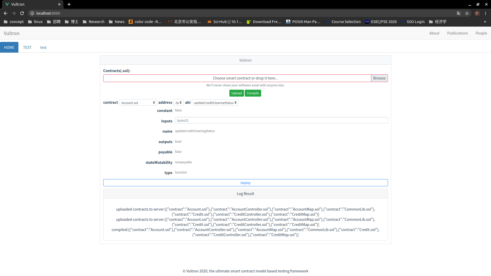

# Vultron-app: the client of the Ultimate Smart Contract Fuzzing Framework (Vultron)

## Get Started
### 1. Run vultron client locally
```bash
   git clone git@github.com:ntu-SRSLab/vultron.git
   cd app 
   npm install
   npm run build
   npm run serve
```
### 2. Customize the client docker image and Run it 
```bash
   git clone git@github.com:ntu-SRSLab/vultron.git
   sudo docker build . -t  vultron/app
   sudo docker run -it -name app  --publish 8080:8080 vultron/app
```
Then please clicks [here](http://localhost:8080/).  The app will look like.
